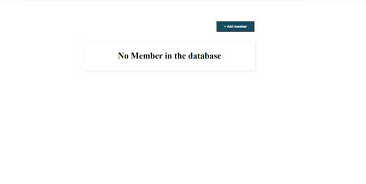
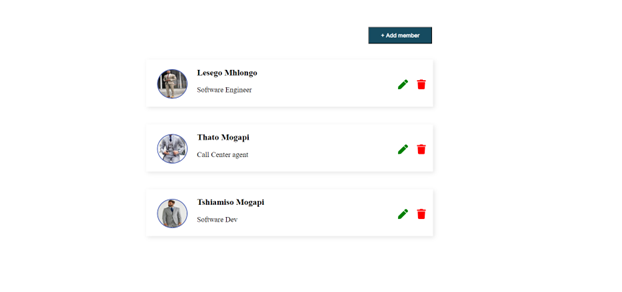
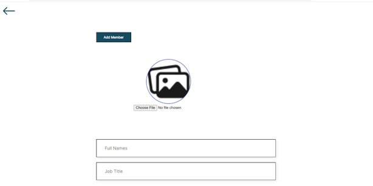
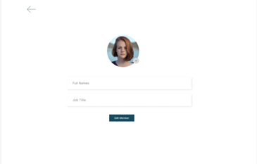

# Project Name: 

## Unit-selection

### Code written by: Lesego Mhlongo


This is a mini project single page web application submitted to [Tshimologong Precinct](https://tshimologong.joburg/) within a period of a week from 14-21 August 2023.The project has 71.4% of React 19.9% of CSS and 8.7% of HTML. 

The main idea of the project is to add, delete and update the members from and to the JSON server so that we can maintain data even when the user refreshes the page. 

## How to navigate through the 'unit-selector' web application:

Components used(in unordered list) :

+ NoMembers
+ AddTask
+ Edit
+ Button
+ Task
+ Tasks
+ Header

As stated above, the project consists of a single page with multiple components embedded on this page. When you first run the application, you will see 'no member component' because the member state is empty (no members in the JSON file list).

No member page:
  
 [](README.md)

Once the user adds members to the list (we will cover in a moment), the page will look like the below image. Each member is uniquelly identified by JSON server's 'id' with attributes of full name, job title and an image. On the top right corner we have an  <font color="green">Add Member</font> button which allows a user to add a member in a list in descending order.


Home Page:


### *Adding a member to the list:*

1. Clicking on the <font color="green">Add Member</font> will direct you to the 'AddTask component' and the page will look like an image below.
2. Three attributes will be required (an image, full name and job title).
3. To upload an image, the user will should click on the choose file button and choose an image of their choice from the local files in their computer.
4. To input the their full name and job title, there are inputs fields which a user can fill. The input fields only takes in strings, so if a user input a number (integer,double,float values etc). An error will be displayed to the user and require them to refill the input field containing false data.
5. Once all the above is corretly done, user can now click on the <font color="green">Add Member</font> button to store a member to the list component, if the submittion is done correctly an alert will be displayed informing the user that a member is added to the list and redirect them to the above component.
6. The back arrow allows the user to discard changes and redirects them to the list component. 

### *Removing/deleting a member from the list:*
1. To delete a member from the list, a user can click on the bin icon.
1. A prompt will be displayed confirming if a user really wants to delete the member. 
2. If a user clicks 'yes' a member will be deleted from JSON file and data member cannot be retrieved.
3. If a user clicks 'no' the member will not be deleted and member data will be visible in a list of members.
   
Add member component:


This application also provides the abiliy to 'edit members'. An image below shows how the edit component looks like. 

### *Edit the member in a list:*
1. On each member, there is an edit icon (Green pen icon). When a user clicks on the icon, the member data is transfered to the edit component and user is redirected to the edit component.
2. User can change an image, full name and job title.
3. If all the attributes are fulled or changed, user can click on the edit button to change member data.
4. A prompt will be displayed informing user that the member details are updated and will be redirected to the list component.



## How to run the 'unit-selector' web application:
#### In visual code (code):
* Download visual code [Here](https://code.visualstudio.com/download)
* Install node.js [Here](https://nodejs.org/en/download)
*  Configure node.js, go to settings, search for Environment variables and include a path to your node.js.

Once installed, open your visual code IDE and on the terminal run the following commands:

```bash
npm install
npm run start
npm run server
```


Project is not yet deployed, However, once it is deployed a 
link will be provide [here](https://github.com/LesegoLSG/ReactProjectRepo.git) on the projects GitHub repository.
  

##### <font color="green">The project is full maintained by myself(Lesego Mhlongo)</font>

### For more information, please feel free to contact me on:
Phone & WhatsApp: (+27) 640373089

Email: lesegomhlongo78@gmail.com

Facebook: [Here](https://www.facebook.com/lesego.mhlongo.3)

Linkedin: [Here](https://www.linkedin.com/in/lesego-mhlongo-081a82228)

##### Qualifications: 

BSc In Computer science & Informatics (University of Johannesburg)

Financial Advisory and Intermediary Services (FAIS Level 4)


